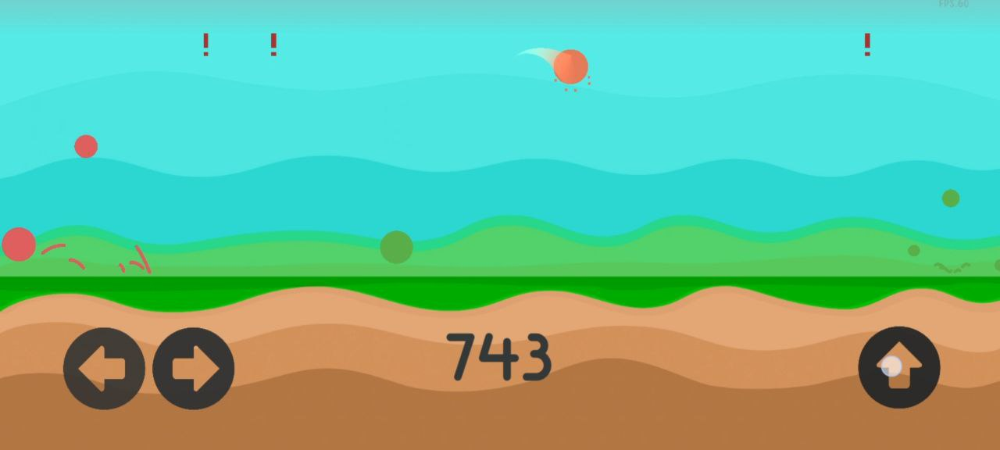
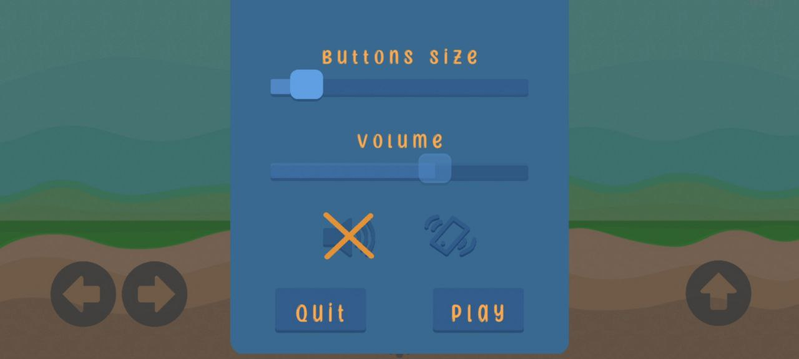

# Lolly Jump

You need to control orange ball to avoid collision with other balls, which spawn at the top of the screen.

Game is available only for Android (can be rebuilt though).

Game made on Unity by Ananasik in 2020, updated and released in 2024.

This project was made for education and portfolio.

# Screenshots

